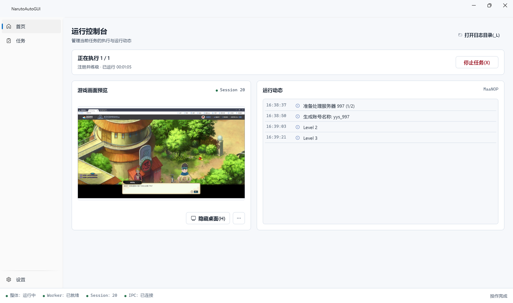
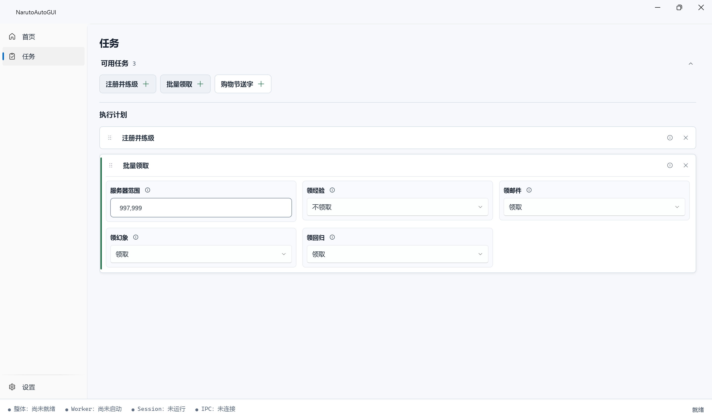

# MaaNOP

<p align="center">
  
  
  
  
  <a href="https://github.com/ArcherSore/MaaNOP/releases" target="_blank"></a>
</p>

MaaNOP 是基于 [MaaFramework](https://github.com/MaaXYZ/MaaFramework) 图像识别技术与行为编排能力开发的《火影忍者 Online》微端自动化辅助工具，配套专用的 Windows 图形客户端 [NarutoAutoGUI](https://github.com/ArcherSore/NarutoAutoGUI)。

> 💡 **核心特色：Windows 原生后台运行，完全不抢占前台键鼠**  
> 游戏与自动化流程运行于 Windows 原生 Child Session（独立子会话 / 桌面分身）中，前台鼠标、键盘与窗口焦点完全不受影响——后台自动练级做日常的同时，前台照常办公、看视频、打游戏。

---

## 界面预览

Dashboard 首页：



Tasks 任务配置页：



---

## 快速开始

1. 前往 [MaaNOP Releases](https://github.com/ArcherSore/MaaNOP/releases) 下载最新的 Windows x64 全量发布包（`MaaNOP-win-x86_64-*.zip`）。
2. 将压缩包**完整解压**到一个无中文或特殊符号的文件夹中（请勿只复制部分文件，不要在压缩包内直接双击运行）。
3. 确保电脑已安装 **火影忍者 Online 微端**（⚠️ **当前仅支持官方微端**，暂不支持 QQ 游戏大厅、360 游戏大厅等）。
4. 双击运行 `NarutoAutoGUI.exe`（在 Windows 提示时允许 UAC 权限）。
5. 在首页点击 **“准备运行环境”**，等待系统拉起独立的 Child Session 后台桌面。
6. 在弹出的会话桌面中正常登录游戏，并停留在 **选服务器界面**。
7. 切换回主窗口的“任务”页，选择并配置任务参数，最后返回首页点击 **“开始任务”**。

> NarutoAutoGUI 会自动从目录中读取 `interface.json` 配置，并自动定位微端启动路径、启动参数与 AppId。

---

## 支持的任务与功能

当前支持的任务均可在图形界面中灵活开关与配置，各任务共享全局的 **服务器范围（ServerRange）** 设置：

### 🚪 前置选服与跨区支持（全局设置）
- **服务器范围格式**：支持形如 `1-10,15,20-25` 的跨区区间配置，任务会按范围依次处理对应区服。
- **智能网格推断**：内置服务器列表动态 OCR 与连续性矩阵校准算法，滚动查找时可自动纠正图像识别噪点，确保选服精准稳定。

### 🐣 注册并练级 (`AccountLeveling`)
- **功能描述**：按设定的服务器范围批量注册新角色，并全自动推进新手主线剧情，从 1 级练至 16 级。
- **关键配置**：
  - `账号前缀（account_prefix）`：用于自动生成新角色名称。
- **注意事项**：该任务要求从全新角色创建起跑，中途异常停止 **暂不支持断点续跑**（未来可能会支持）。

### 🎁 日常与资源批量领取 (`AccountClaims`)
- **功能描述**：面向已完成练级的现有账号，按服务器范围依次登录并一键收割资源。
- **子功能开关**：
  - `日常经验`：自动领取日常活跃与经验（需角色铜币充足）。【下个版本可能会优化】
  - `邮件附件`：一键签收并领取系统与活动邮件。
  - `幻象奖励`：自动领取忍者幻象通关奖励（需已解锁幻象且首通关卡，避免弹出提升战力提示）。【下个版本可能会优化】
  - `回归奖励`：自动领取老玩家回归福利（仅在账号符合回归资格时生效）。

### 🎪 木叶购物节活动 (`ShoppingFestivalTask`)
- **功能描述**：活动期间按服务器范围依次登录，自动处理登录弹窗，进入购物节活动购买打折字帖、刮奖并赠送给指定好友。
- **关键配置**：
  - `好友名称（friend_name）`：指定赠送的目标好友昵称。

---

## 运行要求

### 系统与运行环境
- **操作系统**：Windows 10 / Windows 11（x64）
  - **支持版本**：家庭版（Home）、专业版（Pro）、企业版（Enterprise）、教育版（Education）全版本支持。
  - **权限要求**：管理员权限（UAC 提示需允许，用于启用系统本地会话与窗口捕获）。
- **游戏客户端**：必须安装官方 **火影忍者 Online 微端**。
- **免环境配置**：全量发布包已内嵌免安装绿色 Python（Python 3.12.9）及 `maafw` 等依赖，普通用户无需额外配置 Python 环境。

> [!NOTE]
> **关于 Windows Child Session（桌面分身）的技术说明**
>
> 很多用户误以为“Windows 家庭版不支持远程会话”。实际上，家庭版限制的仅是来自外部网络的“远程桌面服务端连接（RDP Server）”。  
> 本项目采用的 Child Session 是微软自 Windows 8 / Server 2012 起内置的 **本地回环会话（Loopback Session）** 技术（详见 [微软官方文档: Child Sessions](https://learn.microsoft.com/en-us/windows/win32/termserv/child-sessions)）。它直接调用系统底层原生 API（`wtsapi32.dll` 与 `MsRdpClient10`），**无需安装任何 RDP Wrapper 补丁，也无需修改系统系统文件**，家庭版即可原生完美运行。

---

## 工作机制

```text
Main Windows Session (主会话桌面)
└─ NarutoAutoGUI.exe               # 负责任务配置、参数输入、画面实时预览与运行控制
   │
   ▼ (通过系统 Loopback Session 隔离)
Child Session (后台子会话桌面)
└─ NarutoAutoWorker.exe            # 驻留后台的 Worker 进程
   └─ 火影忍者 Online (微端)          # 游戏进程（独立虚拟显示环境）
      └─ MaaFramework / Python Agent # 图像识别与自动化交互逻辑
```

即使在任务进行中关闭预览窗口或锁定当前主桌面（非注销/睡眠），后台 Child Session 中的自动化流程仍会稳定运行。

---

## 常见问题与排查（FAQ）

### 1. 点击“准备运行环境”失败 / 原生 Child Session 说明

- **版本实测**：**Windows 专业版（Pro）开箱即用**（虚拟机已验证）；**家庭版（Home）** 目前仅在开发者实机原生成功运行，其他家庭版设备可能因环境差异报错（如 `0x80070005`）。
- **无魔改证明**：经审计取证，开发机 `termsrv.dll` 为 100% 微软原厂且 Hash 与 WinSxS 一致，未装过 RDP Wrapper，未修改过任何系统服务，家庭版本身具备原生 Child Session 能力。
- **排查建议（自行借助 AI）**：因开发者电脑原生可用、未遇到过报错，暂时无法提供通用修复方案。若启动失败，建议**将以下线索发给 AI 协助诊断**：
  1. 必须右键**以管理员身份运行**；
  2. 检查火绒/360等安全软件是否拦截了本地会话与 RPC；
  3. 若报 `0x80070005`，检查 `C:\ProgramData\Microsoft\Crypto\RSA\MachineKeys` 目录写入权限；
  4. 检查注册表 `fDenyChildConnections` 是否被设为 1。

### 2. 找不到微端或启动失败怎么办？
- 确认安装的是官网独立的 **“火影忍者 Online 微端”**，而非 QQ 游戏大厅版本。
- 确认微端安装路径下启动器可正常手动启动游戏。

### 3. 挂机时电脑可以锁屏或休眠吗？
- **不可系统休眠/睡眠**：系统进入休眠后 CPU 与渲染管线会停止，自动化任务会随之挂起。建议在 Windows 电源设置中将“睡眠”调整为“从不”。
- **关闭显示器**：可以直接关闭显示器或拔掉屏幕线，不影响后台 Child Session 运行。

### 4. 遇到 Bug 如何导出日志与反馈？
若遇到脚本执行错误，请按以下步骤收集信息反馈至 [Issues](https://github.com/ArcherSore/MaaNOP/issues)：
1. 在 NarutoAutoGUI 界面底部的日志窗口中查看报错信息。
2. 收集程序根目录下的日志文件 `./debug/maafw.log`。

---

## 开发说明

本仓库为 MaaNOP 的核心算法与资源仓库，负责维护 MaaFramework 流水线配置、图像与 OCR 资源、`interface.json` 任务协议以及 Python 自定义 Agent。

> 📌 **注**：图形客户端由独立仓库维护，有关 GUI 桌面客户端的架构与构建，请参阅 [NarutoAutoGUI 仓库](https://github.com/ArcherSore/NarutoAutoGUI)。

### 项目目录结构

```text
MaaNOP/
├── assets/
│   ├── interface.json          # 任务配置定义（参数、默认值与 pipeline_override 绑定）
│   ├── resource/
│   │   ├── pipeline/           # MaaFramework 流水线任务节点配置 (JSON)
│   │   ├── image/              # 模板匹配素材特征图片
│   │   └── model/ocr/          # OCR 识别模型
│   └── MaaCommonAssets/        # 通用资产（包含基础 OCR 模型等）
├── agent/                      # 自定义 Python Agent（复杂逻辑、动态识别与控制）
│   ├── main.py                 # Agent 服务入口（基于 AgentServer）
│   ├── reco_*.py               # 自定义识别器（Custom Recognizer）
│   ├── action_*.py             # 自定义动作（Custom Action）
│   ├── common.py               # 共享辅助方法
│   └── constants.py            # 固定坐标、ROI 与常量定义
├── tools/                      # 静态校验、Schema 检查与发布打包脚本
├── docs/                       # 开发规范与个性化配置文档
├── configure.py                # 快速配置基础资源（如 OCR 模型复制）
├── check_resource.py           # 流水线与资源有效性检测
└── install.py                  # 本地资源安装与打包脚本
```

### 开发环境配置

1. **环境准备**：
   - Python 3.10+
   - Node.js 18+（用于静态流水线检查与格式化工具）
   - Git

2. **安装依赖与初始化资源**：
   ```bash
   # 安装 Python 基础依赖
   pip install -r requirements.txt

   # 安装前端检查工具依赖
   npm install

   # 初始化配置默认 OCR 模型（自动从 MaaCommonAssets 复制）
   python configure.py
   ```

3. **配置 Git 提交钩子（Pre-commit Hooks）**：
   本项目使用 `pre-commit` 统一代码风格与提交质量（涵盖 JSON 格式化、MarkdownLint 校验与 PNG 图片无损压缩）：
   ```bash
   pip install pre-commit
   pre-commit install
   ```

### 推荐开发工具与 VSCode 插件

推荐使用 VSCode 进行 Pipeline 与 Agent 开发，并安装以下官方推荐插件：
- **[Maa Pipeline Support](https://marketplace.visualstudio.com/items?itemName=nekosu.maa-support)**：MAA 官方 VS Code 插件，提供 Pipeline 语法高亮、可视化调试、快速框选 ROI、取色及截图功能。
- **[Prettier](https://marketplace.visualstudio.com/items?itemName=esbenp.prettier-vscode)**：统一格式化 JSON / YAML 配置文件。
- **[MarkdownLint](https://marketplace.visualstudio.com/items?itemName=DavidAnson.vscode-markdownlint)**：规范 Markdown 文档格式。

### Agent 开发与核心原则

MaaNOP 遵循“**Pipeline 优先，Python 补充**”的开发规范：

- **Pipeline 优先**：凡是 MaaFramework Pipeline JSON 能够表达的节点、识别与跳转，优先在 `assets/resource/pipeline/` 中使用 JSON 编写；
- **Python 补充**：当面临跨节点复杂状态、动态 ROI / 坐标计算、服务器列表连续性网格推断及滑动控制等场景时，在 `agent/` 中编写自定义识别器（`reco_*.py`）与自定义动作（`action_*.py`）；
- **共享与规范**：跨任务通用工具函数统一沉淀于 `agent/common.py`，固定坐标与 ROI 统一维护于 `agent/constants.py`，保持代码整洁；
- **命名与接口**：避免随意重命名既有 Pipeline 节点及注册的 Recognition / Action 名称，确保向下兼容。

### 提交前检查与测试

在提交代码前，请在终端运行以下命令，确保流水线与代码语法无误：

```powershell
# 1. 运行 MAA 静态检查工具 (maa-checker)
npx @nekosu/maa-tools check

# 2. 校验 JSON Schema
python tools/validate_schema.py --schema-dir deps/tools --resource-dirs assets/resource --interface-files assets/interface.json

# 3. 检查 Python Agent 代码语法编译
python -m compileall agent
```

### 本地构建与打包

若需在本地生成 MaaNOP 核心资源包，可运行：

```bash
python install.py <version>
```
打包输出将生成在 `install/` 目录下。

---

## 免责声明

1. 本项目开源、免费，仅供 Python、图像识别技术及 Windows 系统底层会话机制的学习与交流研究使用。
2. 本软件通过模拟按键与图像识别黑盒交互，不读取、不修改游戏的内存数据、封包或可执行文件。
3. 严禁将本项目及其衍生产品用于商业牟利、代练服务或任何破坏游戏正常运营秩序的行为。使用本工具所产生的一切后果由使用者自行承担。

---

## 鸣谢

- **[MaaFramework](https://github.com/MaaXYZ/MaaFramework)**：强力驱动本项目底层图像识别与自动化流水线架构。
- **[BetterGI (Better Genshin Impact)](https://github.com/babalae/better-genshin-impact)**：本项目核心的 Windows Child Session（独立后台会话 / 桌面分身）方案借鉴并参考了 BetterGI `v0.63.0` 引入的原生接口实现，致以崇高的敬意与感谢！
- 感谢 MAA 开源社区众多优秀游戏小助手项目积累的实践经验与技术沉淀。
