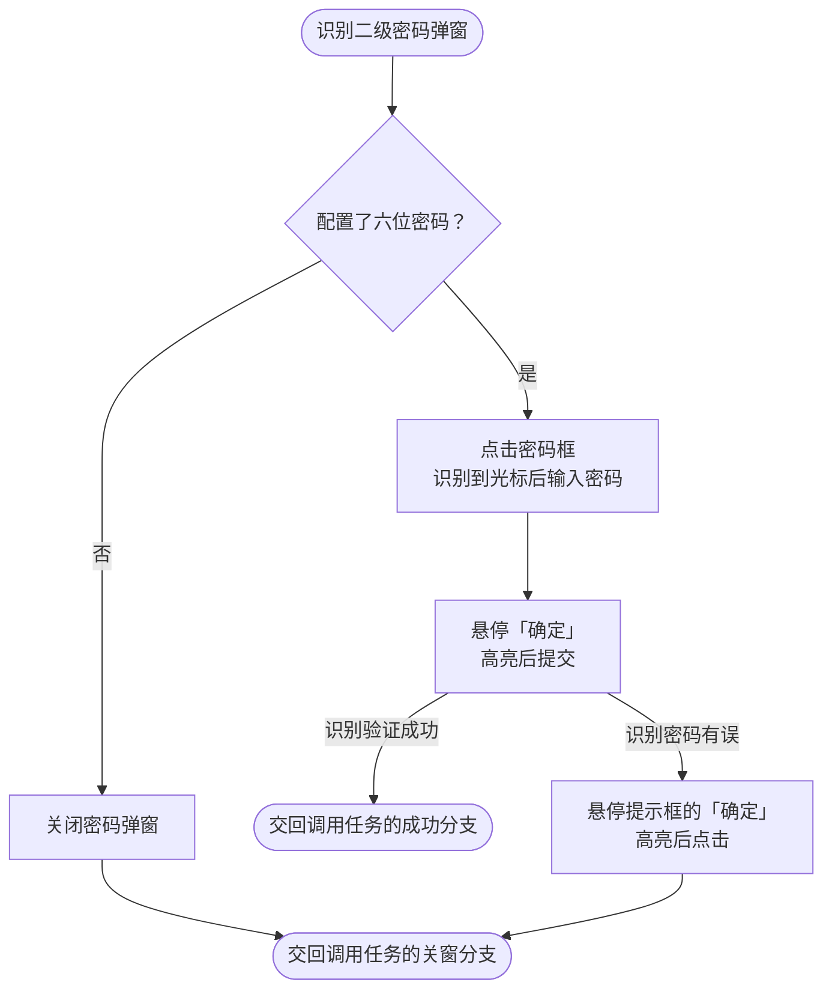

# 公共二级密码流程图

[公共流水线](../../../assets/resource/pipeline/common/SecondaryPassword.json)

```mermaid
flowchart TD
    Start([识别二级密码弹窗]) --> Configured{"配置了六位密码？"}
    Configured -->|是| Focus["点击密码框<br/>识别到光标后输入密码"]
    Configured -->|否| Close["关闭密码弹窗"]
    Focus --> Submit["悬停「确定」<br/>高亮后提交"]
    Submit -->|识别验证成功| Accepted([交回调用任务的成功分支])
    Submit -->|识别密码有误| Rejected["悬停提示框的「确定」<br/>高亮后点击"]
    Close --> Dismissed([交回调用任务的关窗分支])
    Rejected --> Dismissed
```
