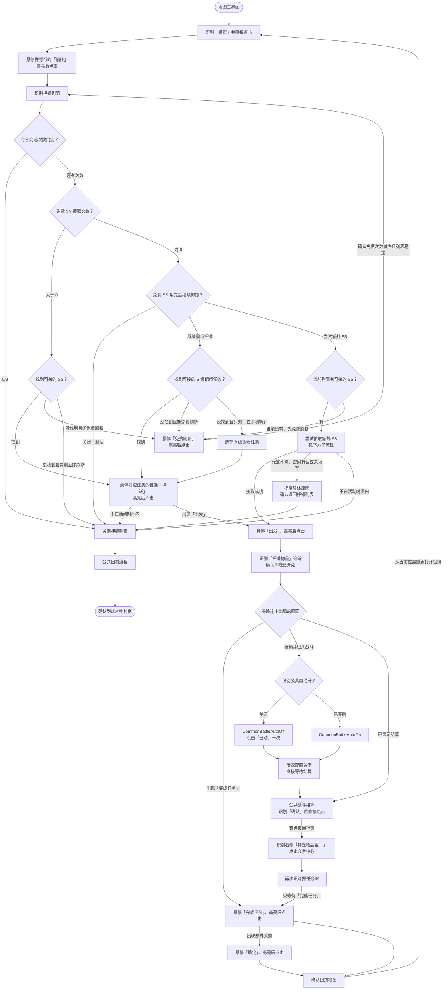
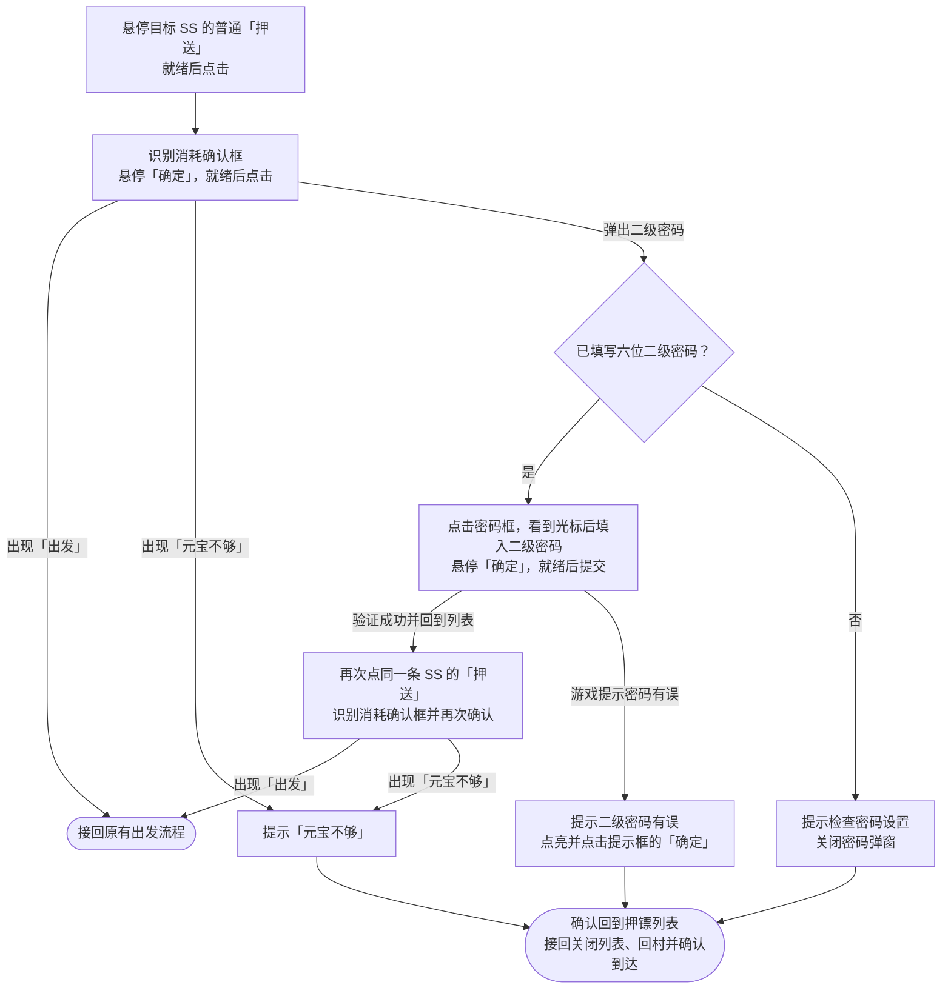

# 押镖流程图

[任务流水线](../../../assets/resource/pipeline/routine/Escort.json)

## 主流程

```mermaid
flowchart TD
    Start([地图主界面]) --> Org["识别「组织」并直接点击"]
    Org --> Go["悬停押镖行的「前往」<br/>高亮后点击"]
    Go --> List["识别押镖列表"]
    List --> Daily{"今日完成次数用完？"}
    Daily -->|0/3| Close["关闭押镖列表"]
    Daily -->|还有次数| Quota{"免费 SS 接取次数？"}
    Quota -->|大于 0| SearchSS{"找到可接的 SS？"}
    Quota -->|为 0| Option{"免费 SS 用完后继续押镖？"}
    Option -->|关闭，默认| Close
    Option -->|继续铜币押镖| SearchS{"找到可接的 S 级铜币任务？"}
    Option -->|尝试额外 SS| SearchExtra{"当前列表有可接的 SS？"}
    SearchExtra -->|有| Extra["尝试接取额外 SS<br/>见下方子流程"]
    SearchExtra -->|当前没有，先免费刷新| Free
    Extra -->|接取成功| Depart
    Extra -->|元宝不够、密码有误或未填写| ExtraEnd["提示具体原因<br/>确认返回押镖列表"]
    ExtraEnd --> Close
    Extra -->|不在活动时间内| Close

    SearchSS -->|找到| Accept["悬停对应任务的普通「押送」<br/>高亮后点击"]
    SearchS -->|找到| Accept
    SearchSS -->|没找到且能免费刷新| Free["悬停「免费刷新」<br/>高亮后点击"]
    SearchS -->|没找到且能免费刷新| Free
    Free -->|确认免费次数减少且列表稳定| List
    SearchSS -->|没找到且只剩立即刷新| Close
    SearchS -->|没找到且只剩「立即刷新」| TakeA["选择 A 级铜币任务"]
    TakeA --> Accept

    Accept -->|不在活动时间内| Close
    Accept -->|出现「出发」| Depart["悬停「出发」，高亮后点击"]
    Depart --> Track["识别「押送物品」追踪<br/>确认押送已开始"]
    Track --> Travel{"寻路途中出现的画面"}
    Travel -->|出现「完成任务」| Finish["悬停「完成任务」，高亮后点击"]
    Travel -->|被劫并进入战斗| Auto{"识别公共自动开关"}
    Auto -->|关闭| AutoClick["CommonBattleAutoOff<br/>点击「自动」一次"]
    Auto -->|已开启| AutoOn["CommonBattleAutoOn"]
    AutoClick --> BattleWait["倍速配置关闭<br/>直接等待结算"]
    AutoOn --> BattleWait
    BattleWait --> Confirm["公共战斗结算<br/>识别「确认」后直接点击"]
    Travel -->|已显示结算| Confirm
    Confirm -->|锚点接回押镖| Resume["识别右侧「押送物品至…」<br/>点击文字中心"]
    Resume --> TrackAgain["再次识别押送追踪"]
    TrackAgain -->|只等待「完成任务」| Finish

    Finish -->|出现额外奖励| Reward["悬停「确定」，高亮后点击"]
    Finish --> Map["确认回到地图"]
    Reward --> Map
    Map -->|从当前位置重新打开组织| Org

    Close --> Return["公共回村流程"]
    Return --> End([确认到达木叶村南])
```

## 接取额外 SS

```mermaid
flowchart TD
    ExtraStart["悬停目标 SS 的普通「押送」<br/>就绪后点击"]
    ExtraStart --> Prompt["识别消耗确认框<br/>悬停「确定」，就绪后点击"]
    Prompt -->|出现「出发」| GoDepart(["接回原有出发流程"])
    Prompt -->|出现「元宝不够」| NoYuanbao["提示「元宝不够」"]
    Prompt -->|弹出二级密码| Configured{"已填写六位二级密码？"}
    Configured -->|是| Password["点击密码框，看到光标后填入二级密码<br/>悬停「确定」，就绪后提交"]
    Configured -->|否| MissingPassword["提示检查密码设置<br/>关闭密码弹窗"]
    Password -->|验证成功并回到列表| Retry["再次点同一条 SS 的「押送」<br/>识别消耗确认框并再次确认"]
    Password -->|游戏提示密码有误| VerifyFailed["提示二级密码有误<br/>点亮并点击提示框的「确定」"]
    Retry -->|出现「出发」| GoDepart
    Retry -->|出现「元宝不够」| NoYuanbao
    NoYuanbao --> Stop(["确认回到押镖列表<br/>接回关闭列表、回村并确认到达"])
    VerifyFailed --> Stop
    MissingPassword --> Stop
```

[公共战斗流程](公共战斗.md) · [公共回村流水线](../../../assets/resource/pipeline/common/ReturnToVillage.json)
