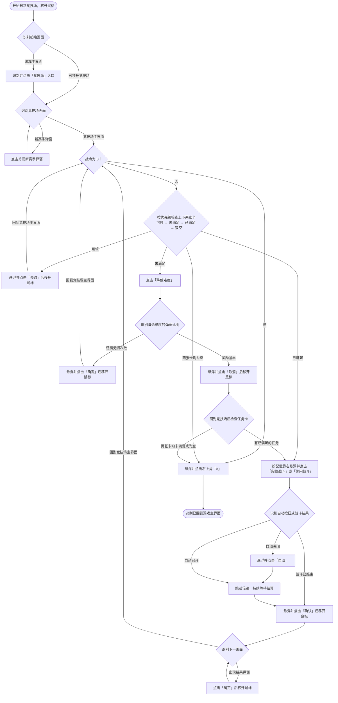

# 日常竞技场流程图

[任务流水线](../../../assets/resource/pipeline/arena/DailyArena.json)

```mermaid
flowchart TD
    Start([开始日常竞技场，移开鼠标]) --> Entry{"识别起始画面"}
    Entry -->|游戏主界面| Open["识别并点击「竞技场」入口"]
    Entry -->|已打开竞技场| Arena{"识别竞技场画面"}
    Open --> Arena
    Arena -->|新赛季弹窗| Season["点击关闭新赛季弹窗"]
    Season --> Arena
    Arena -->|竞技场主界面| Orders{"战令为 0？"}

    Orders -->|是| Close["悬浮并点击右上角「×」"]
    Orders -->|否| Cards{"按优先级检查上下两张卡<br/>可领 → 未满足 → 已满足 → 双空"}
    Cards -->|可领| Claim["悬浮并点击「领取」后移开鼠标"]
    Claim -->|回到竞技场主界面| Orders
    Cards -->|未满足| Lower["点击「降低难度」"]
    Cards -->|已满足| Battle["按配置靠右悬浮并点击<br/>「段位战斗」或「休闲战斗」"]
    Cards -->|两张卡均为空| Close

    Lower --> Dialog{"识别降低难度的弹窗说明"}
    Dialog -->|还有无损次数| Free["悬浮并点击「确定」后移开鼠标"]
    Free -->|回到竞技场主界面| Orders
    Dialog -->|奖励减半| Cancel["悬浮并点击「取消」后移开鼠标"]
    Cancel --> Check{"回到竞技场后检查任务卡"}
    Check -->|有已满足的任务| Battle
    Check -->|两张卡均未满足或为空| Close

    Battle --> State{"识别自动按钮或战斗结果"}
    State -->|自动关闭| Auto["悬浮并点击「自动」"]
    Auto --> Wait["跳过倍速，持续等待结算"]
    State -->|自动已开| Wait
    State -->|战斗已结束| Confirm["悬浮并点击「确认」后移开鼠标"]
    Wait --> Confirm
    Confirm --> Screen{"识别下一画面"}
    Screen -->|出现结果弹窗| Result["点击「确定」后移开鼠标"]
    Result --> Screen
    Screen -->|回到竞技场主界面| Orders

    Close --> End([识别已回到游戏主界面])
```
