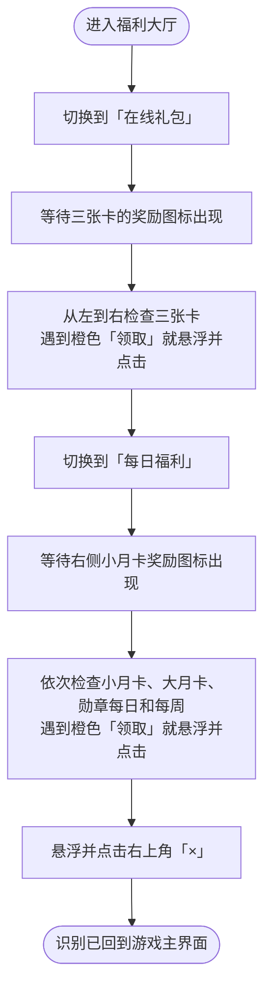

# 福利大厅流程图

[任务流水线](../../../assets/resource/pipeline/routine/welfare/WelfareHall.json)

```mermaid
flowchart TD
    Start([进入福利大厅]) --> Online["切换到「在线礼包」"]
    Online --> Ready["等待三张卡的奖励图标出现"]
    Ready --> Gifts["从左到右检查三张卡<br/>遇到橙色「领取」就悬浮并点击"]
    Gifts --> Daily["切换到「每日福利」"]
    Daily --> DailyReady["等待右侧小月卡奖励图标出现"]
    DailyReady --> Rewards["依次检查小月卡、大月卡、勋章每日和每周<br/>遇到橙色「领取」就悬浮并点击"]
    Rewards --> Close["悬浮并点击右上角「×」"]
    Close --> Done([识别已回到游戏主界面])
```
