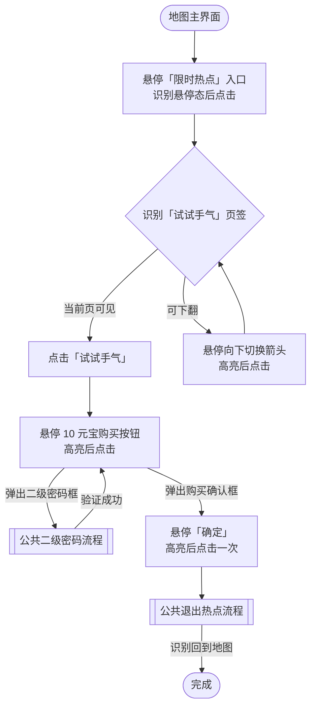

# 试试手气流程图

[任务流水线](../../../assets/resource/pipeline/events/TryYourLuck.json) · [公共热点流水线](../../../assets/resource/pipeline/common/Entry.json) · [公共二级密码流程](公共二级密码.md)

```mermaid
flowchart TD
    Start([地图主界面]) --> Open["悬停「限时热点」入口<br/>识别悬停态后点击"]
    Open --> Tabs{"识别「试试手气」页签"}
    Tabs -->|当前页可见| Select["点击「试试手气」"]
    Tabs -->|可下翻| Scroll["悬停向下切换箭头<br/>高亮后点击"]
    Scroll --> Tabs
    Select --> Buy["悬停 10 元宝购买按钮<br/>高亮后点击"]
    Buy -->|弹出二级密码框| Password[["公共二级密码流程"]]
    Password -->|验证成功| Buy
    Buy -->|弹出购买确认框| Confirm["悬停「确定」<br/>高亮后点击一次"]
    Confirm --> Exit[["公共退出热点流程"]]
    Exit -->|识别回到地图| Done([完成])
```
